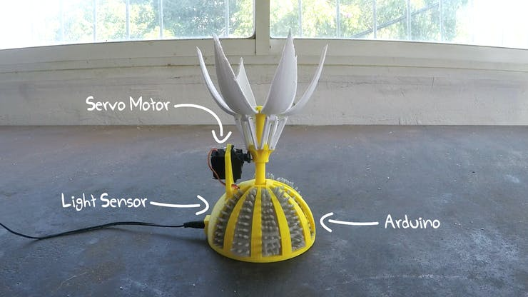

# 1701QCA Making Interaction - Assessment 2

## Project working title ##
Scared of the dark alarm clock

## Related projects ##
*Find about 6 related projects to the project you choose. A project might be related through  function, technology, materials, fabrication, concept, or code. Don't forget to place an image of the related project in the appropriate folder and insert the filename in the appropriate places below. Copy the markdown block of code below for each project you are showing.*

### Related project 1 ###
Butter Passing Robot

http://www.youtube.com/watch?v=TZbxWvc9O6M


This project is related to mine in its aesthetic and idea. The square shape, basic colour, and overcomplication of a simple task are very similar to my project.

### Related project 2 ###
Microbit: Using a buzzer

https://learn.sparkfun.com/tutorials/sparkfun-inventors-kit-for-microbit-experiment-guide/experiment-9-using-a-buzzer


This project is related to mine because it also uses a buzzer to make simple sounds and melodies.

### Related project 3 ###
Digital Watch

https://makecode.microbit.org/projects/watch/digital-watch

```javascript
  let minutes = 0;
  basic.forever(() => {
      basic.pause(60000)
      if (minutes < 59) {
          minutes += 1;
      } else {
          minutes = 0;
      }
  })
```

This project is related to mine in its aesthetic and idea. The square shape, basic colour, and overcomplication of a simple task are very similar to my project.

### Related project 4 ###
A Simple Light Follower

https://www.hackster.io/a-guadalupi/a-simple-light-follower-ad3388


This project is related to mine in its aesthetic and idea. The square shape, basic colour, and overcomplication of a simple task are very similar to my project.

### Related project 5 ###
Valentine's Sunflower

https://www.hackster.io/circuito-io-team/valentine-s-sunflower-3cdd90



This project is related to mine in its aesthetic and idea. The square shape, basic colour, and overcomplication of a simple task are very similar to my project.

## Other research ##
*Include here any other relevant research you have done. This might include identifying readings, tutorials, videos, technical documents, or other resources that have been helpful. For each particular source, add a comment or two about why it is relevant or what you have taken from it.*

### *Brief resource name/description* ###

*Provide a link, reference, or whatever is required for somebody else to find the resource. Then provide a few comments about what you have drawn from the resource.*

## Conceptual progress ##

### Design intent ###
*Include your design intent here. It should be about a 10 word phrase/sentence.*

### Design concept 1 ###
*Outline three design concepts, each developed to a point where you anticipate it would be feasible to complete by the end of the course. Each should have a summary of the idea, a rough sketch of what it might be like, and any other notes you created while exploring the idea.* 

*Put the first two design concepts in the sections "Design concept 1" and "Design concept 2". Then put the third, with more development in the section "Final design concept".*

### Design concept 2 ###
*Put details here.*

### Final design concept ###
*This more fully developed concept should include consideration of the interaction scheme, technical functionality, fabrication approach, materials to be used, and aesthetic.*

### Interaction flowchart ###
*Draw a draft flowchart of what you anticipate the interaction process in your project to be. Make sure you think about all the stages of interaction step-by-step. Also make sure that you consider actions a user might take that aren't what you intend in an ideal use case. Insert an image of it below. It might just be a photo of a hand-drawn sketch, not a carefully drawn digital diagram. It just needs to be legible.*


## Physical experimentation documentation ##

*In this section, show your progress including whichever of the following are appropriate for your project at this point.
a.	Technical development. Could be code screenshots, pictures of electronics and hardware testing, video of tests. 
b.	Fabrication. Physical models, rough prototypes, sketches, diagrams of form, material considerations, mood boards, etc.
Ensure you include comments about the choices you've made along the way.*

*You will probably have a range of images and screenshots. Any test videos should be uploaded to YouTube or other publicly accessible site and a link provided here.*


## Design process discussion ##
*Discuss your process in getting to this point, particularly with reference to aspects of the Double Diamond design methodology or other relevant design process.*

## Next steps ##
*Write a list or provide other information about your plan to move the project forward to be ready to present by video and documentation in week 12 of the course.*
