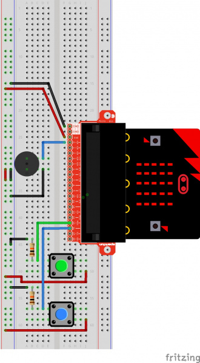
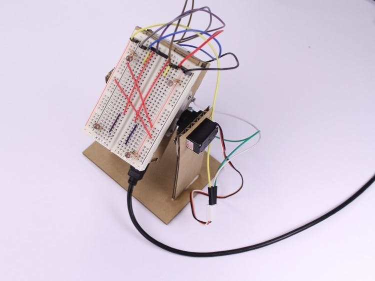
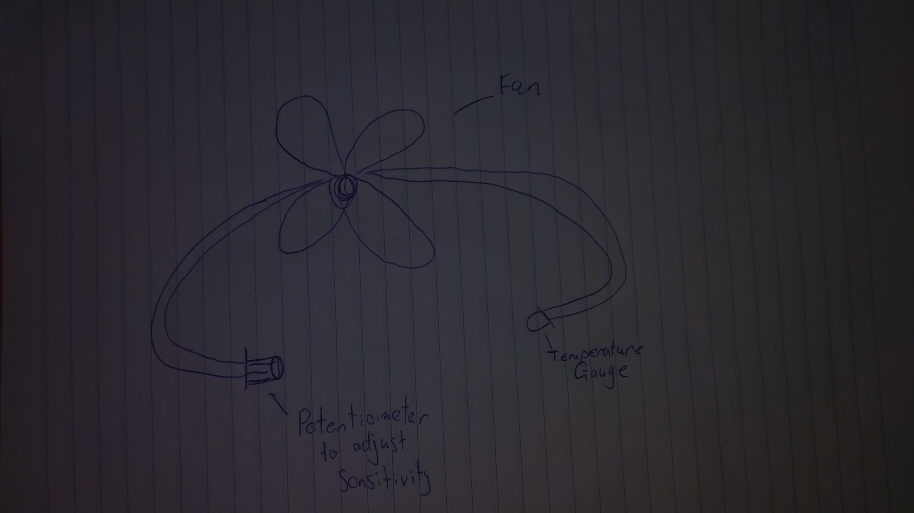
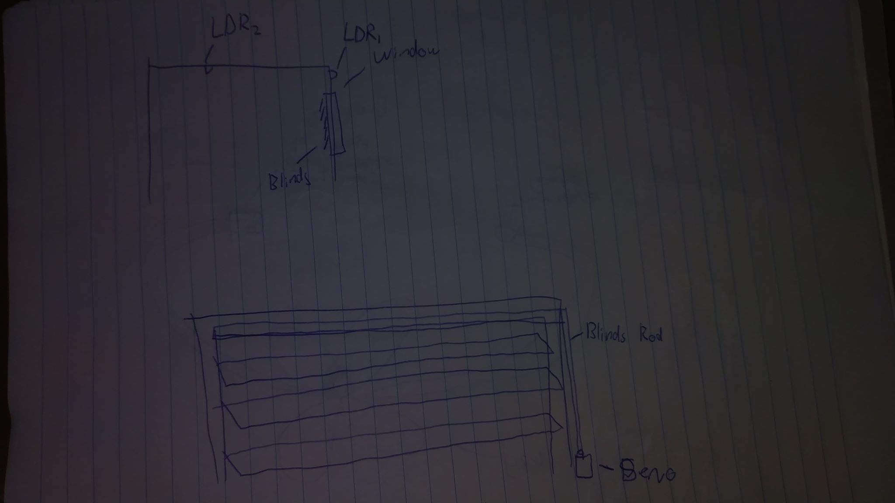
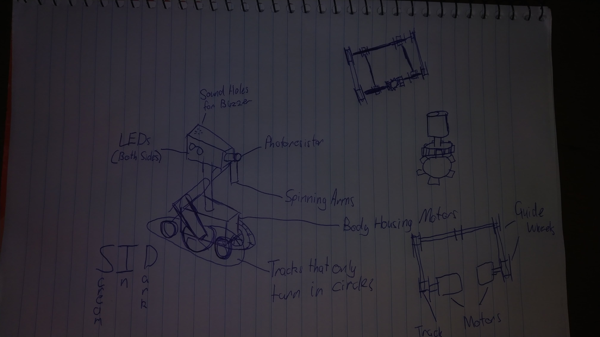
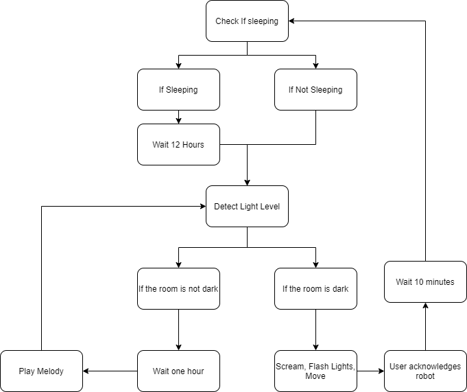
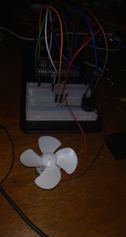
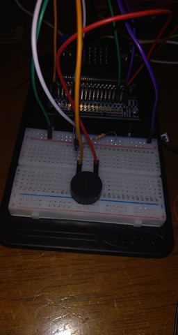

# 1701QCA Making Interaction - Assessment 2

## Project working title ##
SID Robot (Scream in Dark)

## Related projects ##
*Find about 6 related projects to the project you choose. A project might be related through  function, technology, materials, fabrication, concept, or code. Don't forget to place an image of the related project in the appropriate folder and insert the filename in the appropriate places below. Copy the markdown block of code below for each project you are showing.*

### Related project 1 ###
Butter Passing Robot

http://www.youtube.com/watch?v=TZbxWvc9O6M


This project is related to mine in its aesthetic and idea. The square shape, basic colour, and overcomplication of a simple task are very similar to my project.

### Related project 2 ###
Microbit: Using a buzzer

https://learn.sparkfun.com/tutorials/sparkfun-inventors-kit-for-microbit-experiment-guide/experiment-9-using-a-buzzer



This project is related to mine because it also uses a buzzer to make simple sounds and melodies. I can use the circuit diagrams to assist the design of my buzzer integration.

### Related project 3 ###
Digital Watch

https://makecode.microbit.org/projects/watch/digital-watch

```javascript
  let minutes = 0;
  basic.forever(() => {
      basic.pause(60000)
      if (minutes < 59) {
          minutes += 1;
      } else {
          minutes = 0;
      }
  })
```

This project is related to mine in its code execution. The project shown is to become a watch but I can utilize the time counting to play melodies at hour intervals. Because it is created on the microbit, I can sample the code and change it to suit my needs and it should fit perfectly.


### Related project 4 ###
A Simple Light Follower

https://www.hackster.io/a-guadalupi/a-simple-light-follower-ad3388



This project is related to mine in its because it also uses a photoresistor to detect light levels.

### Related project 5 ###
Valentine's Sunflower

https://www.hackster.io/circuito-io-team/valentine-s-sunflower-3cdd90


This project is related to mine in its because it also uses a photoresistor to detect light levels.

## Other research ##
*Include here any other relevant research you have done. This might include identifying readings, tutorials, videos, technical documents, or other resources that have been helpful. For each particular source, add a comment or two about why it is relevant or what you have taken from it.*

### *Brief resource name/description* ###

*Provide a link, reference, or whatever is required for somebody else to find the resource. Then provide a few comments about what you have drawn from the resource.*

### *Five Ways to Blink an LED with Arduino* ###
https://medium.com/@urish/5-ways-to-blink-an-led-with-arduino-8f8a41b4fc7d
Flashing LEDs is an excellent way of grabbing attention, especially when dark. Although this article is written for Arduino which is written in C/C++, it should be easily converted to javascript for the microbit. If after extensive experimentation it turns out that is not the case, I will change the project to use arduino.

## Conceptual progress ##

### Design intent ###
*An interesting device that uses light detection for both functionality use and novelty.*

### Design concept 1 ###
#### Automatic Fan Speed ####
The automatic fan speed device senses ambient room temperature to control the speed of the room's main fan. This keeps a controlled temperature environment within the room and increases circulation based on temperature.


### Design concept 2 ###
#### Self Opening Blinds ####
Self opening blinds use a photoresistor placed outside the window that measures the light level outside. Once the light level reaches a certain threshold a motor is run to open the blinds to allow sufficient light in. The device could also use an internal photoresistor in conjunction with the external one to make sure the room is well lit enough from the inside. 



### Final design concept ###
*This more fully developed concept should include consideration of the interaction scheme, technical functionality, fabrication approach, materials to be used, and aesthetic.*

The final design concept is a simple alarm which is light sensitive and activated when light drops below a specified level. The concept is based on the tendancy to be distracted by things to the point where the user doesn't realise what time of day it is. Generally people who are invested in computer based work or video games play past a point of sundown, when there are usually responsibilites that need to be completed at this time. Rather than a standard alarm clock, it is based as a novelty that would interest people that are usually interested in technology and video games, especially the science fiction world. It uses visual and audio features to alert the user of the ambient light levels. These features include blinking lights, body movement of the robot, and buzzing which could in future be translated to actual sounds through the use of a speaker rather than a buzzer. Because the robot is designed to be 'scared of the dark' it gives a personality to it and allows the user to connect. This provides a sense of companionship especially in current isolation. In future iterations speech could be added to further personify the device.



### Interaction flowchart ###
*Draw a draft flowchart of what you anticipate the interaction process in your project to be. Make sure you think about all the stages of interaction step-by-step. Also make sure that you consider actions a user might take that aren't what you intend in an ideal use case. Insert an image of it below. It might just be a photo of a hand-drawn sketch, not a carefully drawn digital diagram. It just needs to be legible.*

1. The device is first turned on
2. The device plays power up melody
3. Check if asleep
    1. If the device is not asleep
        1. The device checks ambient light levels
           1. If the room is too dark
              1. The device starts screaming
              2. The device starts moving
              3. The device starts flashing
              4. The user acknowledges the device
              5. The device waits ten minutes
              6. The device returns to Step 3
           2. If the room is bright enough
              1. The device waits one hour
              2. The device plays a melody
              3. The device returns to Step 3
    2. If the device is asleep
        1. Wait defined sleep hours
        2. Play wake up melody



## Physical experimentation documentation ##

*In this section, show your progress including whichever of the following are appropriate for your project at this point.
a.	Technical development. Could be code screenshots, pictures of electronics and hardware testing, video of tests. 
b.	Fabrication. Physical models, rough prototypes, sketches, diagrams of form, material considerations, mood boards, etc.
Ensure you include comments about the choices you've made along the way.*

*You will probably have a range of images and screenshots. Any test videos should be uploaded to YouTube or other publicly accessible site and a link provided here.*

#### LED Flashing ####

```javascript
basic.forever(function () {
    LEDFlash(500, DigitalPin.P8);
})


function LEDFlash(time: number, ledPin: DigitalPin) {
    pins.digitalWritePin(ledPin, 1);
    basic.pause(time);
    pins.digitalWritePin(ledPin, 0);
    basic.pause(time);

}
```
[Video of blinking LEDs](https://www.youtube.com/watch?=ayhHdiu8)


#### Motor and Tone ####

The below code takes input from the LDR and compares it to a defined value (that will later be adjustable). If the room is too dark the tone is played and a motor spins. This gives proof of concept for further integration of movement in parts such as the continuous tracks. It also adds the ability to acknowledge the tone and make the device wait a predefined amount of time before it continues detecting light levels.  

```javascript
let light = 0;
let lightValue = 500;
pins.analogSetPitchPin(AnalogPin.P2)

basic.forever(function () {
    checkLight();
    if (input.buttonIsPressed(Button.A)) {
        pins.digitalWritePin(DigitalPin.P0, 0);
        basic.pause(60000);
    }
})

function checkLight() {
    light = pins.analogReadPin(AnalogPin.P1)

    if (light < lightValue) {
        music.playTone(1200, 1000);
        pins.digitalWritePin(DigitalPin.P0, 1)
    } else {
        pins.digitalWritePin(DigitalPin.P0, 0)
        return;
    }
}
```




This is an earlier version of this iteration where just the piezo buzzer is implemented. It used similar code, excluding the ability to wait.


Combining all iterations of this will bring the project closer to its full functionality, but to further refine it more commands will be separated into functions so that its more optimized and readable.

## Design process discussion ##
*Discuss your process in getting to this point, particularly with reference to aspects of the Double Diamond design methodology or other relevant design process.*


## Next steps ##
*Write a list or provide other information about your plan to move the project forward to be ready to present by video and documentation in week 12 of the course.*

To continue the development of the idea I need to build a sturdier and more aesthetic model of the robot itself. Using higher quality materials and better space management to internally store the microbit and wires. Ideally it would be made out of metal but the likeliness of this is low, instead it will probably be made of some sort of wood or stronger card. Another step forward would be further refining the code to make it more optimised and easier to read. The circuit in itself is also rather messy with redundancies and too many wires. Soldering and shorter wires could greatly benefit this issue as well as improve the aesthetic. 
